# Repository_API

Repositorio datos de la base de datos Grupo 1 - Aula 02

Lista endpoints
--------------------------------------------------------------------------
-/
-/dbCheck               // Prueba de conexion a la base de datos
-/usuario/list          // Lista todos los usuarios
-/usuario/show/{id}     // Enseña informacion usuario segun id
-/aula                  // Lista todas las aulas 
-/fichaje               // Lista todos los fichajes
-/insert/{table_name}   // Insert de datos según la tabla 
-/update/{table_name}   // Update de datos según la tabla
-/delete/{table_name}   // Delete de datos según la tabla
-/select/{table_name}   // Select de datos según la tabla
---------------------------------------------------------------------------

A continuación, imagenes de pruebas según cada endpoint

Root - /

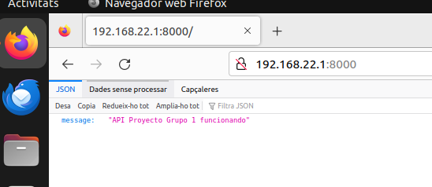

/dbCheck

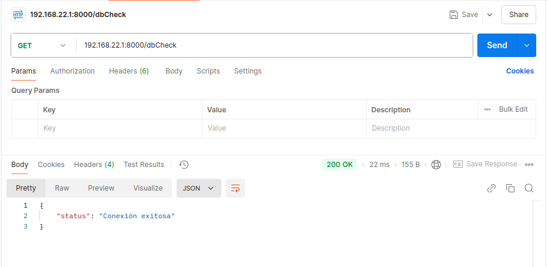

/usuario/list

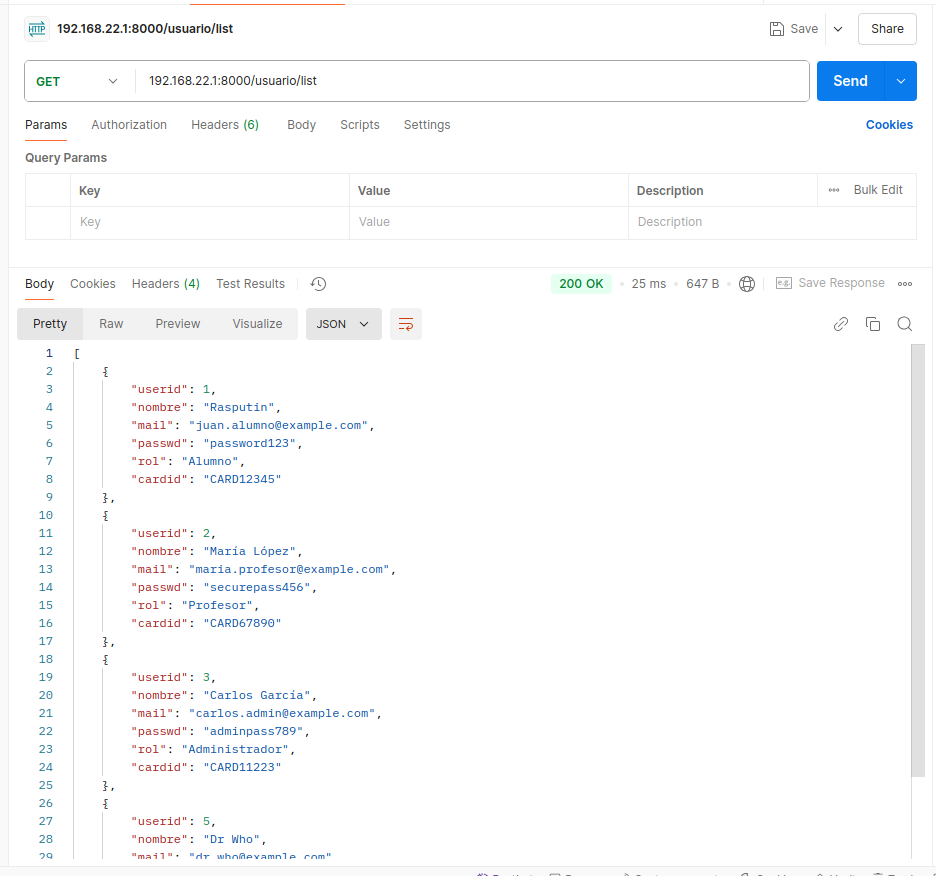

/usuario/show/{id}

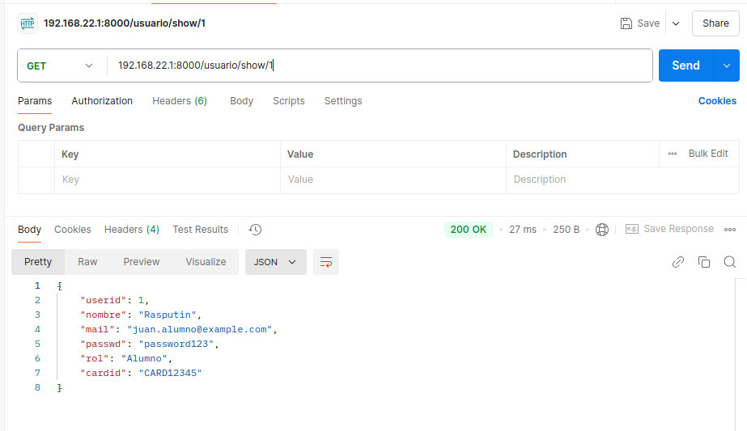

/aula

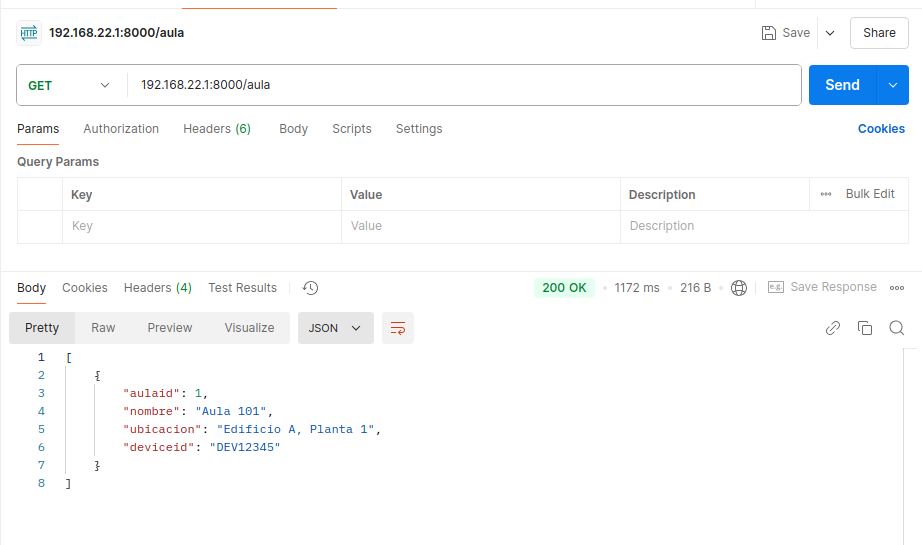

/fichaje

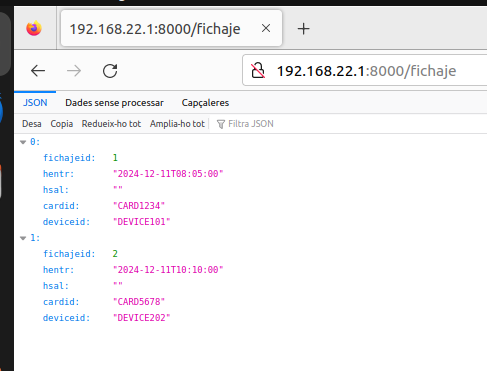

/insert/{table_name} - Primera imagen

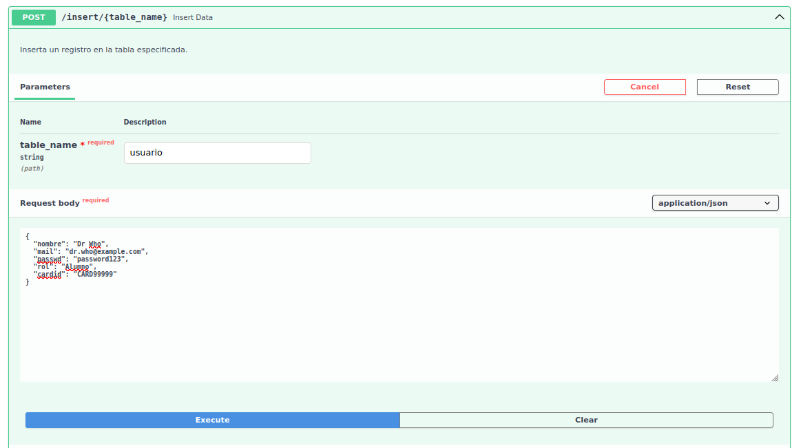

Segunda imagen

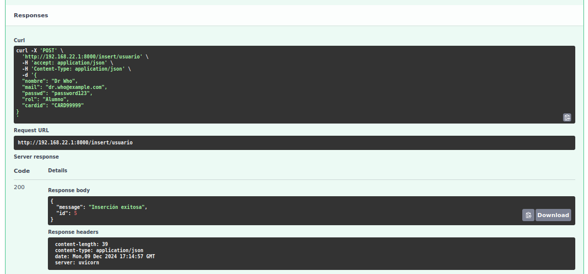

/update/{table_name} - Primera imagen

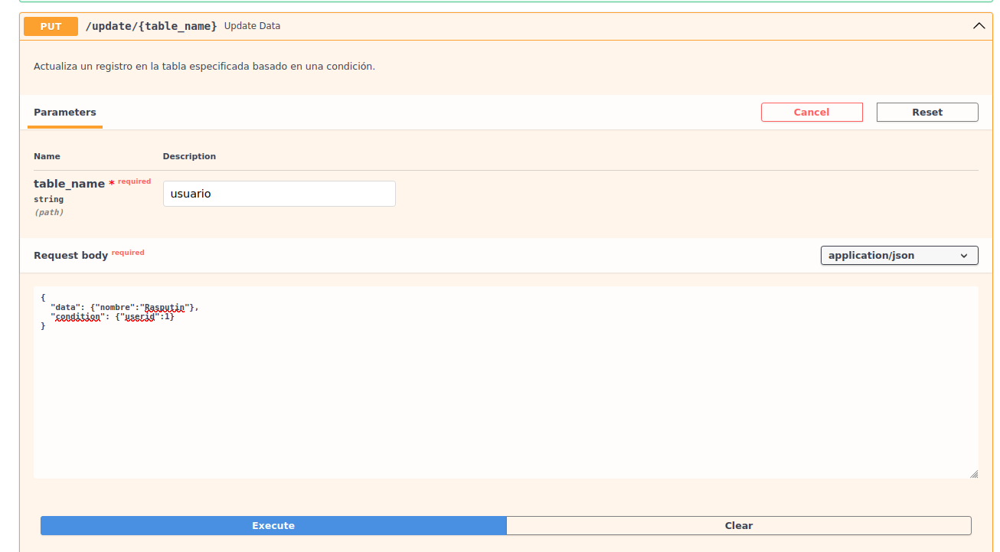

Segunda imagen

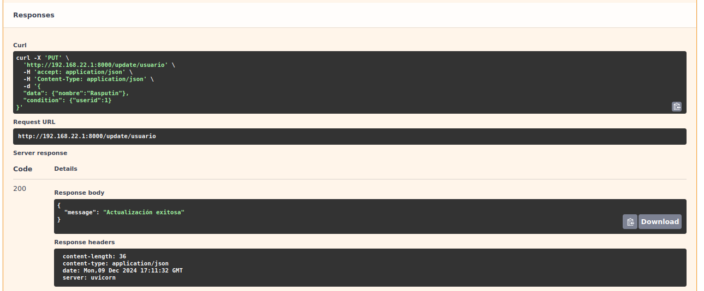

/delete/{table_name} - Primera imagen

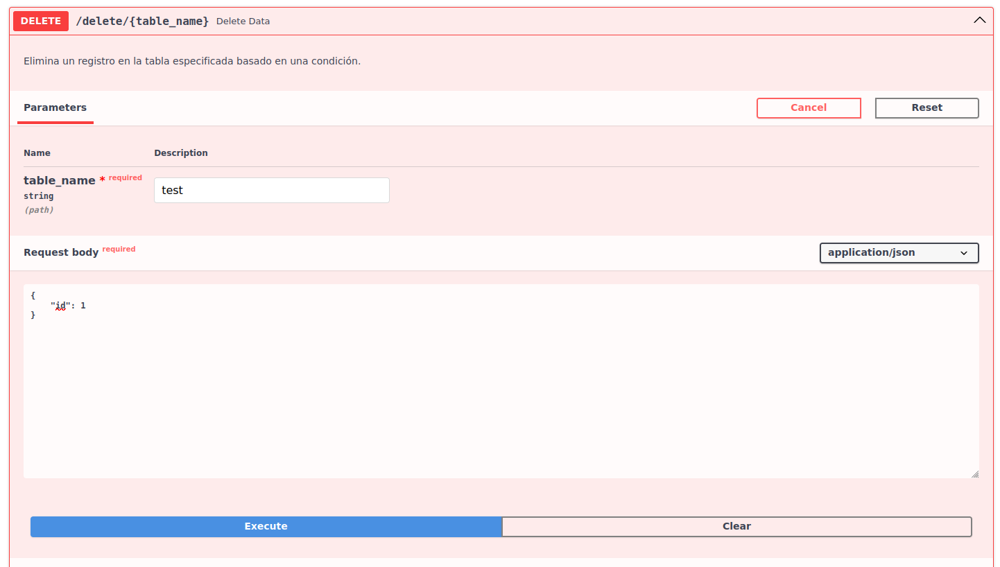

Segunda imagen

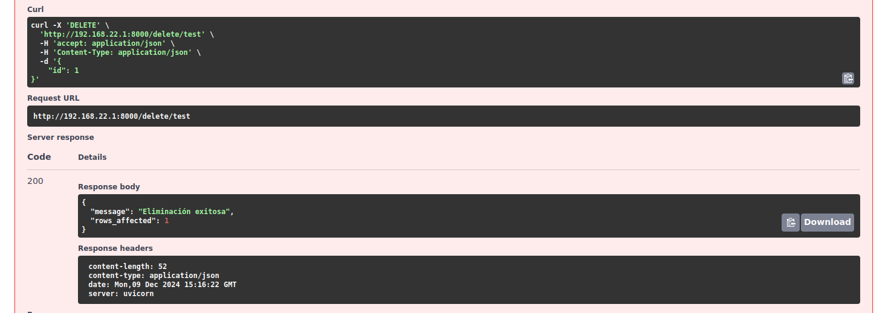

/select/{table_name} - Primera imagen

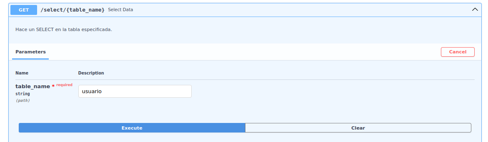

Segunda

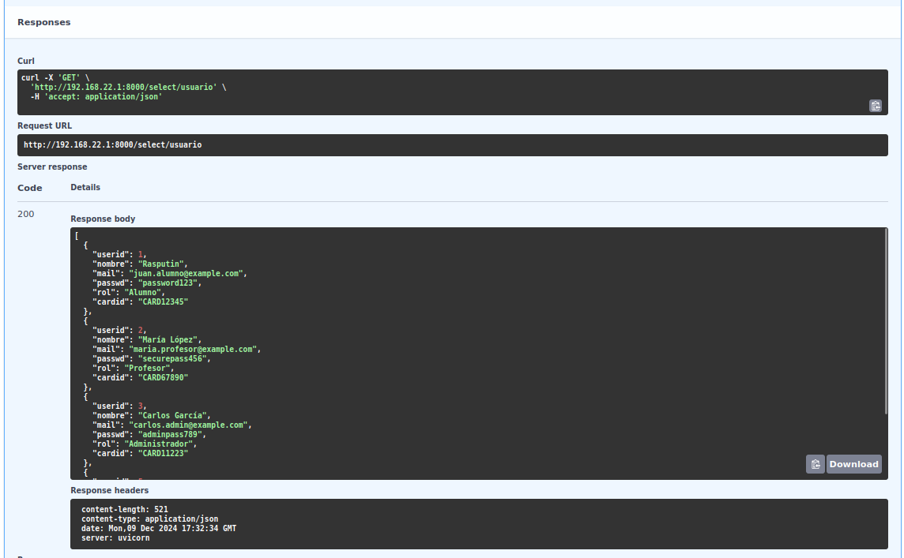